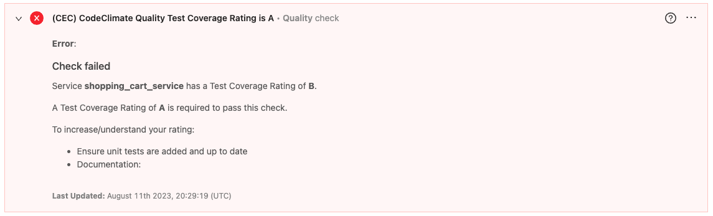
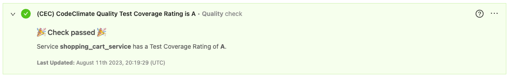

# Objective

To ensure that all services have a Test Coverage Rating of "A", as determined by Code Climate.

Code Climate does not support sending webhooks.
To accomplish this, we can use a bash script that GETs the test reports for all repos in the CodeClimate org account and push the results to the OpsLevel Custom Event Check integration endpoint.

Code Climate's API supports getting back a list of test reports per repo: https://developer.codeclimate.com/?shell#get-test-coverage-reports

# Bash script

[codeclimate_test_reports.sh](codeclimate_test_reports.sh)

# Custom Event Check config

[codeclimate-quality-test-coverage-rating-is-a.yml](codeclimate-quality-test-coverage-rating-is-a.yml)

# Result Examples

Check Failed Example

Check Passed Example

