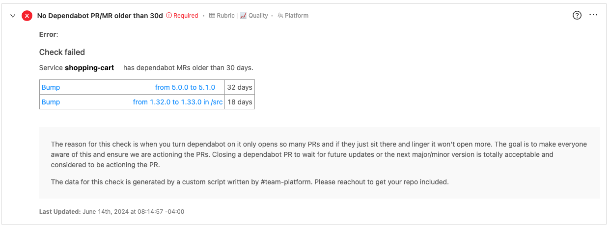
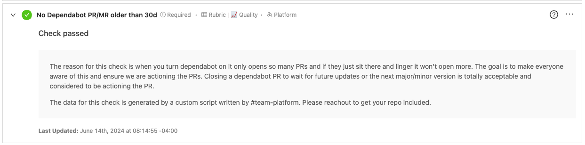

# Objective

To ensure that all services do not have any PR/MR's older than 30 days. The check can be cloned and modified to check against a different PR age threshold.

Examples:
* Silver: No Dependabot PR older than 30 days
* Gold: No Dependabot PR older than 14 days

GitHub does not support sending aggregated data containing open pull requests via webhooks.

GitHub's API supports retrieving a list of pull requests.

# Bash script

[dependabot_pr_age.sh](dependabot_pr_age.sh)

Notes:
* The bash script would need to run on a schedule to provide up-to-date information to OpsLevel.
* The included bash script checks for open pull requests from both GitHub and GitLab, looking for pull requests/merge requests labeled with "dependencies".

# Custom Event Check config

[dependabot_check_config.yaml](dependabot_check_config.yaml)

# Result Examples

Check Failed Example

Check Passed Example

