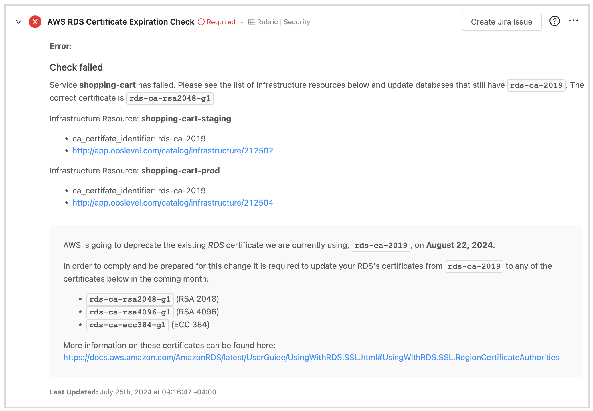
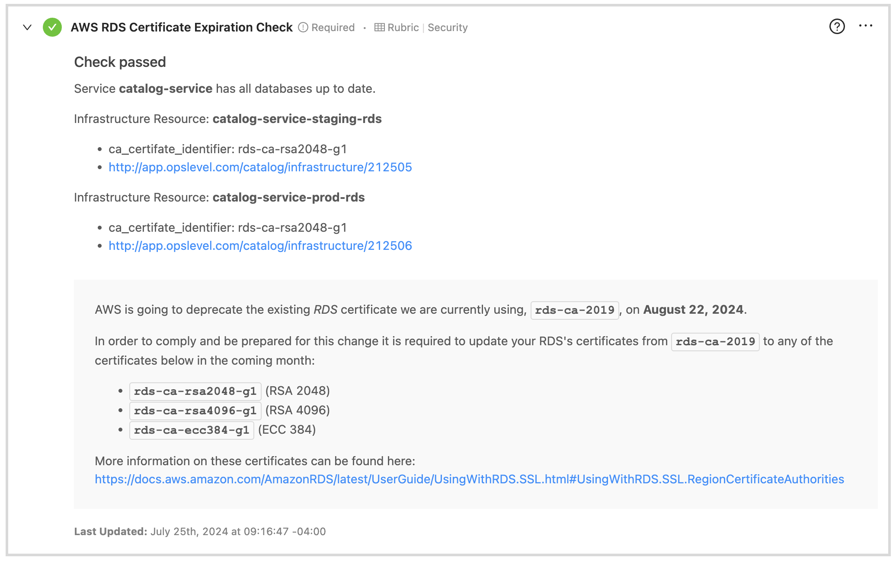
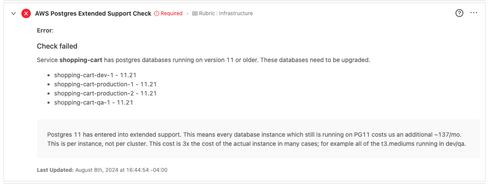
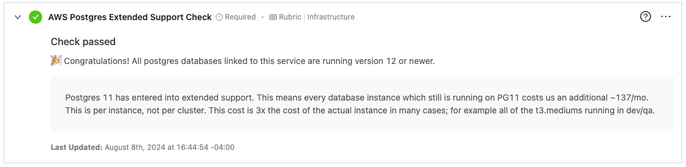

# Objective

To create a Custom Event Check to ensure all services with related AWS RDS databases have up to date CA certificates for those RDS databases.

Why: Want to ensure that all services' RDS databases CA certificates are updated before the old certificates expire.

# Pre-requisites

Ensure AWS infrastructure resources are tagged with the appropriate AWS tags to automatically create relationships between infrastructure resources and services inside of OpsLevel. Docs can be found here: https://docs.opslevel.com/docs/import-infrastructure-objects-via-aws#inferring-ownershiprelationships-via-aws-tags

# Bash script

[opslevel_query_services_and_related_infra.sh](opslevel_query_services_and_related_infra.sh)

Note: The bash script would need to run on a schedule to provide up-to-date information to OpsLevel.

Requirements:
* OpsLevel CLI https://github.com/OpsLevel/cli
* jq https://stedolan.github.io/jq/

# Service Infrastructure Checks

* [RDS Certificate Expiration Check](#rds-certificate-expiration-check-custom-event-check-config)
* [PostgreSQL Extended Support Check](#postgresql-extended-support-check-custom-event-check-config)

## RDS Certificate Expiration Check Custom Event Check config

[aws-rds-certificate-expiration-check.yml](aws-rds-certificate-expiration-check.yml)

### Result Examples

Check Failed Example

Check Passed Example

## PostgreSQL Extended Support Check Custom Event Check config

[aws-postgres-extended-support-check.yml](aws-postgres-extended-support-check.yml)

### Result Examples

Check Failed Example

Check Passed Example

