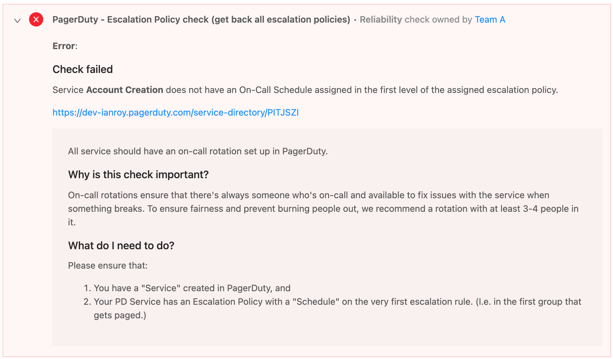
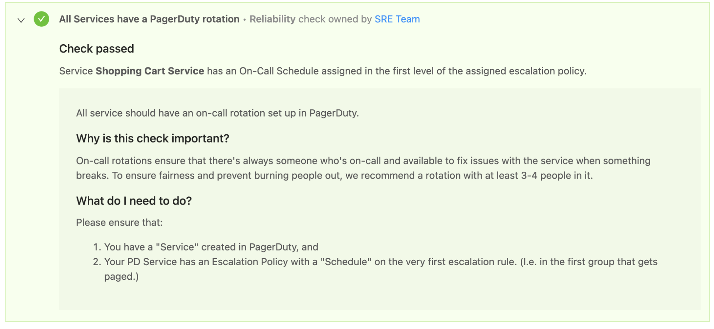

# Objective

To create a Custom Event Check to ensure all services have a PagerDuty on-call rotation configured in the first level of the assigned Escalation Policy.

Why: Want to ensure that all services meet the criteria that an on-call rotation has been configured in PagerDuty.

Although PagerDuty has webhooks, their webhooks do not include information about the Escalation Policy’s on-call rotation for a service.
To accomplish this, we can use a short bash script that GETs the full list of escalation policies with their corresponding details and push the results to the OpsLevel webhook.

PagerDuty’s API supports getting back a list of all existing escalation policies: https://developer.pagerduty.com/api-reference/b3A6Mjc0ODEyNA-list-escalation-policies

# Bash script

```
#!/bin/bash

# Fill in your API tokens:
PD_API_TOKEN="ADD PAGERDUTY API TOKEN HERE"
OL_CEC_ENDPOINT="https://app.opslevel.com/integrations/custom_event/<ADD ENDPOINT TOKEN FROM OPSLEVEL HERE>"

PD_ESCALATION_POLICIES=$(curl \
    -H "Accept: application/vnd.pagerduty+json;version=2" \
    -H "Authorization: Token token=${PD_API_TOKEN}" \
    -X GET https://api.pagerduty.com/escalation_policies)

#echo "PD_ESCALATION_POLICIES is $PD_ESCALATION_POLICIES"

curl -i \
    -H "Content-Type: application/json" \
    -X POST "$OL_CEC_ENDPOINT" \
    --data-binary "$PD_ESCALATION_POLICIES"
```

Note: The bash script would need to run on a cron job to provide updated information to OpsLevel if the Escalation Policy changes or if a different escalation policy is assigned to a Service.

# Result Examples

Check Failed Example



Check Passed Example


