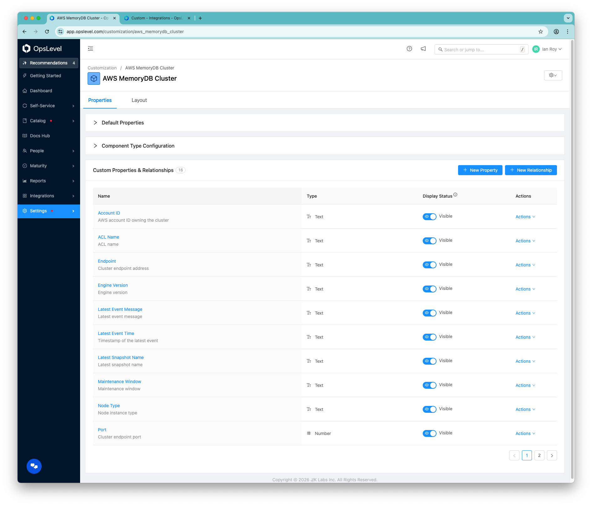
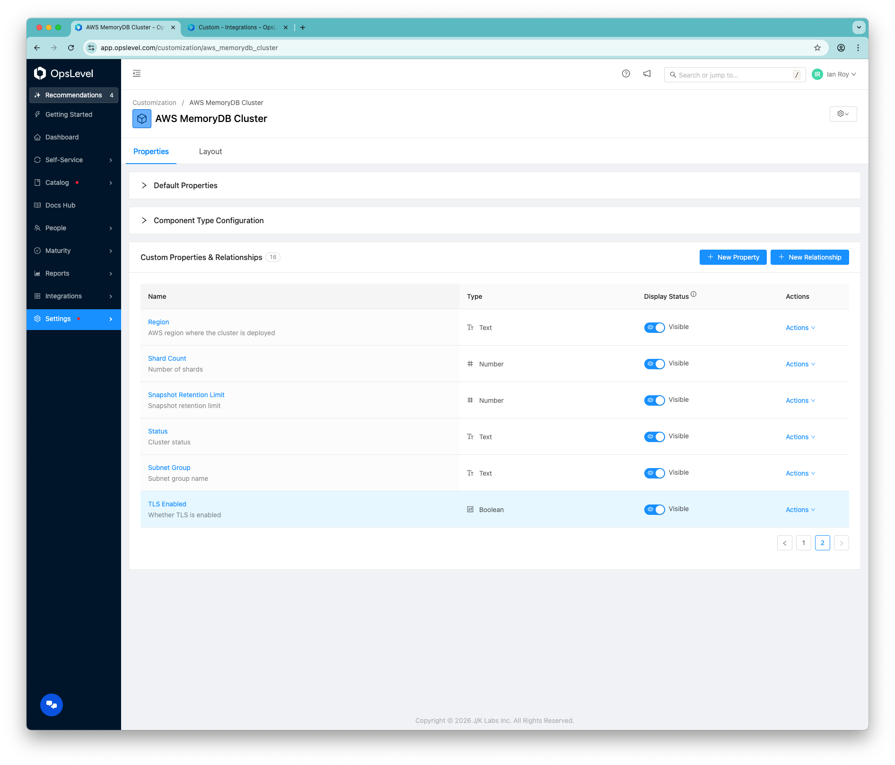
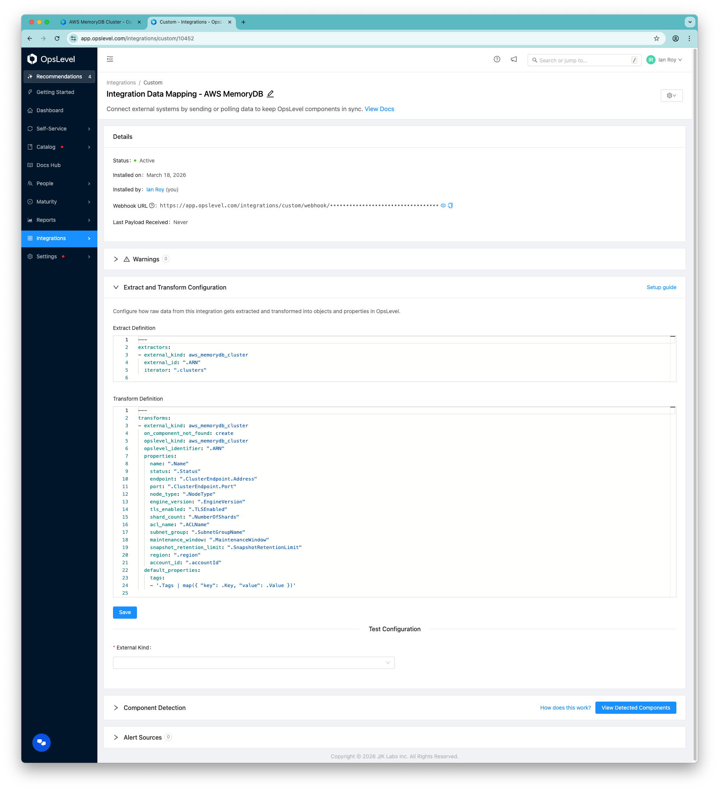

# AWS MemoryDB → OpsLevel Custom Integration

This guide shows how to set up an AWS Lambda that collects raw AWS MemoryDB cluster data across one or more regions and sends that JSON to an OpsLevel Custom Integration webhook, where OpsLevel maps the data into custom properties using extractor and transform YAML.

## Overview

```text
AWS EventBridge Scheduler
  ↓
AWS Lambda
  ↓
AWS MemoryDB DescribeClusters API
  ↓
Raw cluster JSON payload
  ↓
OpsLevel Custom Integration Webhook
  ↓
Extractor + Transform YAML
  ↓
OpsLevel component type + custom properties
```

This design keeps the Lambda simple and pushes most of the mapping logic into OpsLevel.

## What this setup does

The Lambda:

- queries MemoryDB clusters from all supported AWS regions or from a specific region list
- fetches AWS resource tags for each cluster via `ListTags`
- keeps the cluster payload mostly raw from `DescribeClusters`, plus `Tags`, `region`, and `accountId`
- posts the payload to the OpsLevel webhook

OpsLevel:

- receives the raw JSON
- iterates over `.clusters`
- uses JQ expressions to map raw AWS fields into custom properties

## Why use this pattern

This approach is useful because:

- the Lambda stays small and easier to maintain
- you can add or change mapped properties in OpsLevel without changing Lambda code
- you retain the full cluster data structure for future mapping changes
- you avoid direct OpsLevel polling of AWS APIs

## Prerequisites

You need:

- an AWS account with access to MemoryDB
- at least one MemoryDB cluster, or permission to query MemoryDB APIs
- permission to create Lambda, IAM roles and policies, and EventBridge schedules
- an OpsLevel account with access to Custom Integrations, component type creation, and custom properties
- an OpsLevel Custom Integration webhook URL

---

## Suggested rollout plan

### Recommended implementation order

1. Create the OpsLevel component type.
2. Create the OpsLevel custom integration.
3. Add extractor and transform YAML.
4. Create the IAM role.
5. Deploy Lambda.
6. Test Lambda without the webhook.
7. Enable the webhook.
8. Validate component creation in OpsLevel.
9. Add the EventBridge schedule.
10. Expand properties later as needed.

---

## Part 1: Create the OpsLevel side

### 1. Create the component type in OpsLevel

Create a component type for MemoryDB clusters using this GraphQL mutation:

```graphql
mutation aws_memorydb {
  componentTypeCreate(
    input: {
      category: "infrastructure"
      name: "AWS MemoryDB Cluster"
      alias: "aws_memorydb_cluster"
      properties: [
        {
          name: "Status"
          alias: "status"
          description: "Cluster status"
          schema: "{\"type\":\"string\"}"
          propertyDisplayStatus: visible
          allowedInConfigFiles: false
        }
        {
          name: "Endpoint"
          alias: "endpoint"
          description: "Cluster endpoint address"
          schema: "{\"type\":\"string\"}"
          propertyDisplayStatus: visible
          allowedInConfigFiles: false
        }
        {
          name: "Port"
          alias: "port"
          description: "Cluster endpoint port"
          schema: "{\"type\":\"integer\"}"
          propertyDisplayStatus: visible
          allowedInConfigFiles: false
        }
        {
          name: "Node Type"
          alias: "node_type"
          description: "Node instance type"
          schema: "{\"type\":\"string\"}"
          propertyDisplayStatus: visible
          allowedInConfigFiles: false
        }
        {
          name: "Engine Version"
          alias: "engine_version"
          description: "Engine version"
          schema: "{\"type\":\"string\"}"
          propertyDisplayStatus: visible
          allowedInConfigFiles: false
        }
        {
          name: "TLS Enabled"
          alias: "tls_enabled"
          description: "Whether TLS is enabled"
          schema: "{\"type\":\"boolean\"}"
          propertyDisplayStatus: visible
          allowedInConfigFiles: false
        }
        {
          name: "Shard Count"
          alias: "shard_count"
          description: "Number of shards"
          schema: "{\"type\":\"integer\"}"
          propertyDisplayStatus: visible
          allowedInConfigFiles: false
        }
        {
          name: "ACL Name"
          alias: "acl_name"
          description: "ACL name"
          schema: "{\"type\":\"string\"}"
          propertyDisplayStatus: visible
          allowedInConfigFiles: false
        }
        {
          name: "Subnet Group"
          alias: "subnet_group"
          description: "Subnet group name"
          schema: "{\"type\":\"string\"}"
          propertyDisplayStatus: visible
          allowedInConfigFiles: false
        }
        {
          name: "Maintenance Window"
          alias: "maintenance_window"
          description: "Maintenance window"
          schema: "{\"type\":\"string\"}"
          propertyDisplayStatus: visible
          allowedInConfigFiles: false
        }
        {
          name: "Snapshot Retention Limit"
          alias: "snapshot_retention_limit"
          description: "Snapshot retention limit"
          schema: "{\"type\":\"integer\"}"
          propertyDisplayStatus: visible
          allowedInConfigFiles: false
        }
        {
          name: "Latest Snapshot Name"
          alias: "latest_snapshot_name"
          description: "Latest snapshot name"
          schema: "{\"type\":\"string\"}"
          propertyDisplayStatus: visible
          allowedInConfigFiles: false
        }
        {
          name: "Latest Event Message"
          alias: "latest_event_message"
          description: "Latest event message"
          schema: "{\"type\":\"string\"}"
          propertyDisplayStatus: visible
          allowedInConfigFiles: false
        }
        {
          name: "Latest Event Time"
          alias: "latest_event_time"
          description: "Timestamp of the latest event"
          schema: "{\"type\":\"string\",\"format\":\"date-time\"}"
          propertyDisplayStatus: visible
          allowedInConfigFiles: false
        }
        {
          name: "Region"
          alias: "region"
          description: "AWS region where the cluster is deployed"
          schema: "{\"type\":\"string\"}"
          propertyDisplayStatus: visible
          allowedInConfigFiles: false
        }
        {
          name: "Account ID"
          alias: "account_id"
          description: "AWS account ID owning the cluster"
          schema: "{\"type\":\"string\"}"
          propertyDisplayStatus: visible
          allowedInConfigFiles: false
        }
      ]
    }
  ) {
    componentType {
      id
      name
    }
    errors {
      message
      path
    }
  }
}
```




### 2. Create the custom integration in OpsLevel

In OpsLevel:

1. Go to **Integrations**.
2. Create a **Custom Integration**.
3. Copy the **Webhook URL**.
4. Save it for the Lambda environment variable `OPSLEVEL_WEBHOOK_URL`.

### 3. Add the extractor YAML

```yaml
---
extractors:
- external_kind: aws_memorydb_cluster
  external_id: ".ARN"
  iterator: ".clusters"
```

### 4. Add the transform YAML

```yaml
---
transforms:
- external_kind: aws_memorydb_cluster
  on_component_not_found: create
  opslevel_kind: aws_memorydb_cluster
  opslevel_identifier: ".ARN"
  properties:
    name: ".Name"
    status: ".Status"
    endpoint: ".ClusterEndpoint.Address"
    port: ".ClusterEndpoint.Port"
    node_type: ".NodeType"
    engine_version: ".EngineVersion"
    tls_enabled: ".TLSEnabled"
    shard_count: ".NumberOfShards"
    acl_name: ".ACLName"
    subnet_group: ".SubnetGroupName"
    maintenance_window: ".MaintenanceWindow"
    snapshot_retention_limit: ".SnapshotRetentionLimit"
    region: ".region"
    account_id: ".accountId"
  default_properties:
    tags:
    - '.Tags | map({ "key": .Key, "value": .Value })'
```

#### What the transform is doing

OpsLevel will look at each item in `.clusters` and map raw AWS fields directly, including `.Status`, `.ClusterEndpoint.Address`, `.NodeType`, `.EngineVersion`, `.TLSEnabled`, `.NumberOfShards`, and the Lambda-added metadata `.region` and `.accountId`. AWS resource tags (`.Tags`) are mapped to OpsLevel component tags via `default_properties.tags` using `.Tags | map({ "key": .Key, "value": .Value })`.



---

## Part 2: Create the AWS Lambda

### 5. Create the IAM role

Create an IAM role for Lambda with:

- basic Lambda logging permissions
- permission to call MemoryDB read APIs

Use a policy like this:

```json
{
	"Version": "2012-10-17",
	"Statement": [
		{
			"Effect": "Allow",
			"Action": [
				"memorydb:DescribeClusters",
				"memorydb:ListTags"
			],
			"Resource": "*"
		}
	]
}
```

### 6. Create the Lambda function

Create a Lambda function with:

- Runtime: Python
- Architecture: x86_64 or arm64
- Execution role: the IAM role above

A good function name is `memorydb-to-opslevel`.

---

## Part 3: Lambda environment variables

### 7. Add environment variables

Set these on the Lambda.

Required:

```text
OPSLEVEL_WEBHOOK_URL=<your_opslevel_webhook_url>
```

Optional:

```text
REGION_MODE=all
REGION_LIST=
CLUSTER_FILTER=
LOG_LEVEL=INFO
```

#### Supported region modes

Query all available MemoryDB regions:

```text
REGION_MODE=all
```

Query only specific regions:

```text
REGION_MODE=list
REGION_LIST=us-east-1,us-west-2,eu-west-1
```

#### Optional single-cluster filter

To only send one cluster:

```text
CLUSTER_FILTER=orders-cache
```

#### Logging control

Use `LOG_LEVEL=INFO` for normal logging, `LOG_LEVEL=DEBUG` for verbose troubleshooting.

---

## Part 4: Lambda script

### 8. Deploy this Lambda code

[lambda_function.py](./lambda_function.py)

---

## Part 5: Test the Lambda

### 9. Create a basic test event

Use an empty event:

```json
{}
```

### 10. First test without OpsLevel webhook

To validate the Lambda first:

- temporarily remove `OPSLEVEL_WEBHOOK_URL`
- run the function
- inspect the returned payload

Expected output will include `cluster_count`, `regions_requested`, `region_errors`, and a `payload.clusters[]` array.

### 15. Then enable the OpsLevel webhook

Once the payload looks right:

- restore `OPSLEVEL_WEBHOOK_URL`
- rerun the Lambda
- verify the payload appears in OpsLevel

---

## Part 6: Schedule the sync

### 11. Add EventBridge Scheduler

Create a schedule to invoke Lambda automatically.

Examples:

- `rate(1 day)`

Daily is a good default unless you need more frequent updates.

---

## Part 7: Troubleshooting

#### If you see MemoryDB endpoint timeouts

For example:

```text
Connect timeout on endpoint URL: "https://memory-db.us-east-1.amazonaws.com/"
```

That means Lambda cannot reach the AWS MemoryDB API endpoint over HTTPS.

Common causes:

- Lambda is attached to a VPC private subnet with no NAT gateway
- security group blocks outbound 443
- subnet route table has no default route
- NACL blocks outbound or return traffic

#### Easiest fix for network timeout

If the Lambda does not need private VPC resources, remove it from the VPC.

If it must stay in the VPC:

- place Lambda in private subnets
- add a NAT gateway in a public subnet
- add route `0.0.0.0/0 -> NAT Gateway`
- allow outbound TCP 443 in the security group

#### If OpsLevel webhook POST fails

Check:

- `OPSLEVEL_WEBHOOK_URL` is correct
- Lambda has outbound internet access
- `external_kind=aws_memorydb_cluster` matches the extractor and transform config

#### If no components are created in OpsLevel

Check:

- extractor `external_kind` matches transform `external_kind`
- webhook query parameter matches `aws_memorydb_cluster`
- `opslevel_kind` exists as `aws_memorydb_cluster`
- transform uses valid JQ expressions
- incoming cluster objects contain `.ARN`

#### If the wrong number of clusters appears

Check:

- `REGION_MODE`
- `REGION_LIST`
- `CLUSTER_FILTER`

For focused testing, use:

```text
REGION_MODE=list
REGION_LIST=us-east-1
```

---

## Part 8: Extending the integration later

### Add more OpsLevel properties without changing Lambda

Because the Lambda sends raw cluster objects, you can add more transform mappings later.

Examples:

```yaml
memorydb_parameter_group: ".ParameterGroupName"
memorydb_data_tiering: ".DataTiering"
memorydb_auto_minor_version_upgrade: ".AutoMinorVersionUpgrade"
```

As long as those fields are present in the raw cluster payload, you only need to update the transform and component properties in OpsLevel.
