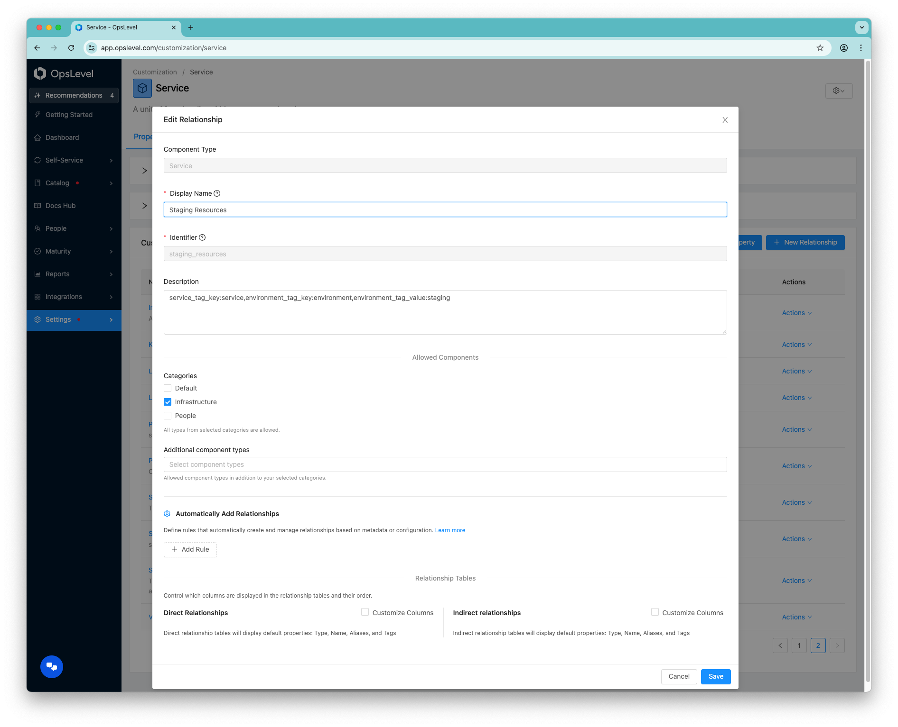

# Create relationships from union of tags

This script creates OpsLevel relationships between **default** (service) components and **infrastructure** components based on tag matching. It reads relationship definitions whose description contains tag rules, then creates `related_to` relationships when infrastructure tags match the rules.

NOTE: This will only create relationships for the Service componentType at this time.

## How it works

1. **Relationship definitions**: Fetches relationship definitions for the service component type and keeps only those whose `description` contains `service_tag_key`. The description is parsed as comma-separated `key:value` pairs to get:
   - `service_tag_key` – tag key on infrastructure that should match a default component alias
   - `environment_tag_key` – tag key for environment
   - `environment_tag_value` – value for that environment (e.g. `staging`, `production`)




2. **Matching**: For each such rule and each default component, the script finds infrastructure components that have **both**:
   - A tag `(environment_tag_key, environment_tag_value)` (e.g. `environment:staging`)
   - A tag `(service_tag_key, value)` where `value` is one of the **default component’s aliases** (e.g. `service:shopping_cart`)

   So **service_tag_value** is not read from the description; it is the default component’s alias that is matched against the infrastructure tag value (case-sensitive).

3. **Creation**: For each (default component, infrastructure component, rule) triple, it calls the `relationshipCreate` mutation with `source` = default component, `target` = infrastructure component, `type: "related_to"`, and the relationship definition id.

## Requirements

- Python 3.10+
- Install deps: `pip install -r requirements.txt`

## Environment

- **OPSLEVEL_API_TOKEN** (required): OpsLevel API token with permission to read services/relationship definitions and create relationships.

## Usage

```bash
export OPSLEVEL_API_TOKEN="your-token"

# Dry run: only print what would be created
python create_relationships_from_union_of_tags.py --dry-run

# Verbose: log pagination and each created relationship
python create_relationships_from_union_of_tags.py --verbose

# Create relationships
python create_relationships_from_union_of_tags.py
```

## Options

| Option       | Description                                                                 |
|-------------|------------------------------------------------------------------------------|
| `--dry-run` | Print planned (source, target, relationship definition) without mutating.    |
| `--verbose` | Log pagination progress and each successful relationship creation.           |

## Idempotency

The script does not query existing relationships before creating. Re-running is safe, if the relationship already exists, it is a no-operation in OpsLevel.
