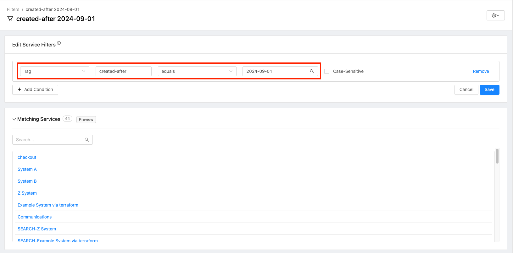

# Filter and Tag Services Using the opslevel-cli

The opslevel-cli commands and steps below can be used to filter services by a particular property and tag the resulting services. A subsequent filter can be created in OpsLevel based on the tag assigned.

In this example, services are filtered based on their `createdAt` date if they were created after a specific date and then tagged with the `created-after` tag.

Some steps using the opslevel-cli can be chained, but kept separate for simplicity.

# Requirements

* opslevel-cli installed https://github.com/OpsLevel/cli
* jq https://stedolan.github.io/jq/

# Steps and commands

1. Grab the list of services in OpsLevel and output to a services_<date-time>.json file using the following opslevel-cli command. Replace <date-time> with the current date and time for uniqueness. e.g. services_20241022-1636.json

```
opslevel list services -o json > services_<date-time>.json
```

Example:

```
opslevel list services -o json > services_20241022-1636.json
```

2. Convert the specific date you have in mind to Unix Timestamp (using this online converter for example: https://www.timestamp-converter.com/).

In this example I want to find services created after 2024-09-01 so the Timestamp is 1725148800

3. Use the following jq expression to filter and get the list of service ids that were created after that date. Replace UNIX_TIMESTAMP with your timestamp.

```
cat services_<date-time>.json| jq '.[] | if .timestamps.createdAt | split("T").[0] + "T00:00:00Z" | fromdateiso8601 > UNIX_TIMESTAMP then .id else empty end' > service_ids_output.txt
```

Example:
```
cat services_20241022-1636.json| jq '.[] | if .timestamps.createdAt | split("T").[0] + "T00:00:00Z" | fromdateiso8601 > 1725148800 then .id else empty end' > service_ids_output.txt
```

3. Run the following opslevel-cli command to read the ids from the file and write a tag to those services. Replace KEY and VALUE.

In this example, the tag added will be `created-after:2024-09-01` to the services. The tag can be deleted from all services using the opslevel-cli in the future if needed.

```
cat service_ids_output.txt | while read -r item; do
  item=$(echo "$item" | tr -d '"' | xargs)
  opslevel create tag --type=Service $item KEY VALUE
done
```

Example:

```
cat service_ids_output.txt | while read -r item; do
  item=$(echo "$item" | tr -d '"' | xargs)
  opslevel create tag --type=Service $item created-after 2024-09-01
done
```

4. An OpsLevel filter can be created looking for the tag.

