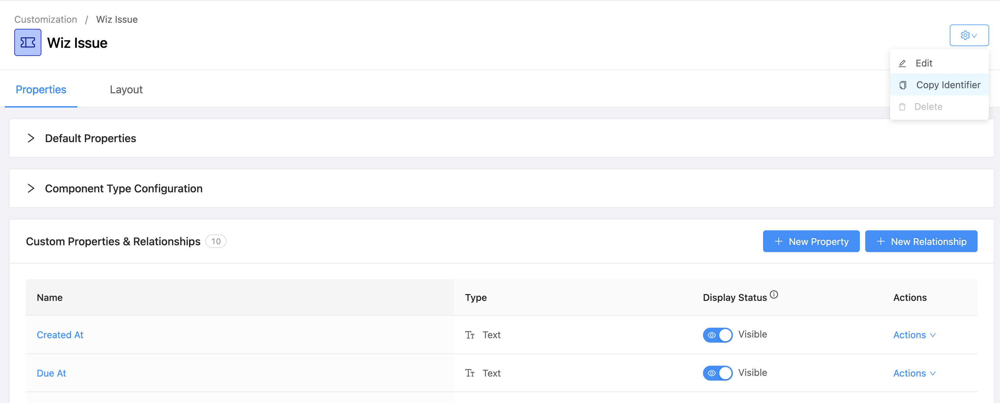

# OpsLevel Bulk Service Component Type Updater

A Python command-line utility for bulk updating the Component Type of OpsLevel services. Services are filtered efficiently using multiple criteria directly supported by the OpsLevel GraphQL API.

---

## ⚠️ Requirements

* **Python 3.6+**
* **Dependencies:** `requests`, `argparse` (standard library), `sys`, `os` (standard library)
* **OpsLevel API Token:** A valid OpsLevel API Token with appropriate write permissions (Mutations).

---

## 💡 Prerequisites and Notes

Before running this script, it is crucial to understand the implications of changing a Service's Component Type, especially regarding Checks and Scorecards.

* **Read Official Documentation:** For full details on the impact of this change, please consult the official OpsLevel documentation on [Changing Component Types](https://docs.opslevel.com/docs/components#changing-types).
* **Type Exists:** Ensure the Component Type specified by your `--target-type-id` already exists in OpsLevel.
* **Check Compatibility:** When changing a Component Type, any **Service Checks** that were previously inherited from the *old* Component Type will be removed if they are not also part of the *new* Component Type. This may immediately change the Scorecard status of the affected services.
* **Scorecard Recalculation:** Scorecards will be immediately recalculated for all affected services after the update is complete.

---

## ⚙️ Usage

The script requires several mandatory arguments to define the filtering criteria and the target Component Type ID.

### Command Structure

```bash
python bulk_update_services.py \
    --target-type-id <NEW_TYPE_ID> \
    --source-type-id-filter <OLD_TYPE_ID> \
    --tag-arg <TAG_EQUALS> \
    --tag-arg-1 <TAG_DOES_NOT_EQUAL> \
    [--dry-run]
````

---

## 🆔 Obtaining Component Type Identifiers

To retrieve the **Component Type ID** (required for `--target-type-id` or `--source-type-id-filter`):

1. In OpsLevel, navigate to:
   **Settings → Customization → Component Types**
2. Click on the desired **Component Type** (e.g., *Wiz Issue*, *Service*, *API*, etc.).
3. On the top-right corner of the Component Type detail page, click the **gear icon ⚙️**.
4. Select **“Copy Identifier”** from the dropdown menu.
   This will copy the Component Type’s unique ID to your clipboard.
5. Paste that value into your script argument, for example:

   ```bash
   --target-type-id "T3mR9r7J1x"
   ```

Example visual reference:
From the *Wiz Issue* component type screen:

> `Settings → Customization → <Component Type> → ⚙️ → Copy Identifier`



---

## 📘 Example

```bash
python bulk_update_services.py \
    --target-type-id "T3mR9r7J1x" \
    --source-type-id-filter "A2bC8xY9Lk" \
    --tag-arg "Environment=prod" \
    --dry-run
```

When run with `--dry-run`, the script will print a list of all services that would be updated without applying changes.

---

## ✅ Output

Example output:

```
Found 42 matching services with type_id=A2bC8xY9Lk
Would update to new type_id=T3mR9r7J1x
Dry run mode: no changes applied.
```

---

## 🔒 Security Notes

* The OpsLevel API token must be stored securely (e.g., as an environment variable).
* Example:

  ```bash
  export OPSLEVEL_API_TOKEN="olp_xxx..."
  ```

---